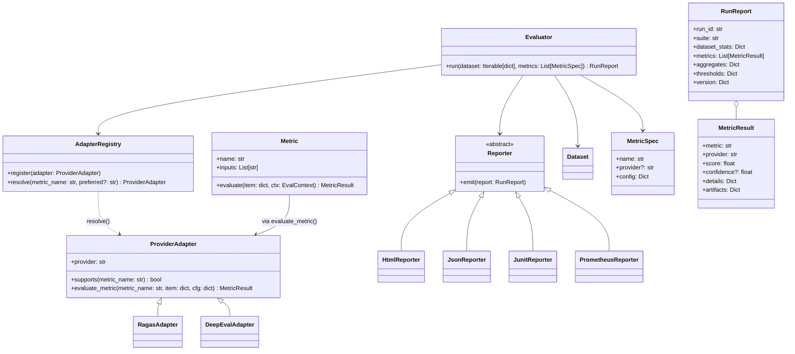

# Unified LLM Evaluation Interface (ULEI)

**Requirements, Technical Design & Implementation Plan — v0.1**

> Focus for v0.1 adapters: **DeepEval** and **Ragas**. Goal: provide a single, stable interface over heterogeneous metric providers for pre‑prod and post‑prod evaluation of LLM and RAG systems.

---

## 1) Product Vision & Objectives

**Vision.** Become the “pytest + Terraform‐providers” of AI evaluation: one spec, many backends.

**Objectives.**

- Unify metric invocation across providers (start with Ragas & DeepEval).
- Provide a **consistent data model** for inputs/outputs & a **portable report schema**.
- Support **two execution spheres** from day one: (1) offline batch eval (pre‑prod) and (2) online shadow/periodic eval (post‑prod).
- Be **extensible** (plug‑in metrics/providers) and **CI/CD‑friendly** (gates, diffs, regressions).

**Non‑Goals.**

- Re‑implement every metric algorithm. We **wrap** providers first; native metrics later.
- Reinvent a feature store or observability platform.

---

## 2) Key Personas & Primary Use Cases

**Personas**

- **AI QA Engineer (primary):** defines eval suites, runs in CI, triages regressions.
- **MLOps/Platform Engineer:** integrates with pipelines, observability, and secrets.
- **Applied Scientist:** experiments with metrics and judge prompts.

**Use Cases**

1. **RAG regression suite** comparing model/embedding/retriever changes.
2. **Prompt refactor** gating: accuracy & faithfulness must not drop >2%.
3. **Canary/Shadow eval** on 5% prod traffic with daily roll‑up and drift alerts.
4. **Release diff report** (before/after) pushed to Slack & stored in S3.

---

## 3) Scope (MVP)

- Providers: **Ragas** (faithfulness, context precision/recall) and **DeepEval** (accuracy, relevancy, semantic similarity, fluency/conciseness, retrieval metrics, etc.).
- Artifacts: **Python SDK**, **CLI**, **YAML config DSL**, **HTML/JSON reports**.
- Data connectors: local JSONL/CSV; HTTP ingestion for online eval; S3/GCS sink.
- CI templates: GitHub Actions, Azure Pipelines.

Out‑of‑scope v0.1: Full safety/jailbreak suite, enterprise authZ, UI dashboard.

---

## 4) Success Criteria (Measurable)

- ≤ **3 lines** to switch a metric provider (Ragas ↔ DeepEval) without touching datasets.
- **Stable JSON schema** for results across providers.
- **CI gate**: non‑zero exit on regression thresholds; optional flaky‑run retrials.
- Batch throughput: **≥ 25 QPS** local (single worker) on cache‑warm small models.

---

## 5) Glossary (Working)

- **Metric**: A computation returning a scalar (or vector) score plus evidence.
- **Evaluator**: Orchestrates metrics over datasets/streams.
- **Adapter**: Bridges our interfaces to provider SDKs (Ragas/DeepEval).
- **Run**: A concrete execution of an evaluator with config, producing a report.

---

## 6) System Architecture Overview

```
+---------------------------+        +-----------------------+
|  CLI / Python SDK / API  |        |   Report Consumers    |
|  - ulei run ...          |        |  - CI (JUnit/XML)     |
|  - ulei diff ...         |        |  - HTML/JSON          |
+------------+--------------+        +-----------+-----------+
             |                                    |
             v                                    v
      +------+-------------------------------+  +---------------------+
      |             Evaluator                |  |   Storage/Sinks     |
      |  - loads Dataset(s)                  |  |  - FS/S3/GCS        |
      |  - schedules Metric(s)               |  |  - Prometheus push  |
      |  - aggregates Results                |  |  - Slack/Webhooks   |
      +------+-------------------+-----------+  +---------------------+
             |                   |
             v                   v
   +---------+-------+   +-------+----------+
   |  ProviderAdapter |   |  ProviderAdapter |
   |     (Ragas)      |   |    (DeepEval)    |
   +---------+--------+   +--------+---------+
             |                      |
             v                      v
       Ragas SDK/API          DeepEval SDK/API
```

**Components**

- **Evaluator Service**: Pure‑python core (sync/async), pluggable execution (batch/streaming).
- **Provider Adapters**: Thin wrappers translating our Metric spec → provider calls.
- **Result Aggregator**: Normalizes provider outputs to a shared schema.
- **Reporters**: HTML, JSON, JUnit/XML, Prometheus (p50/p95, success rates).
- **Caches**: Optional local LM cache (prompt+completion) to control cost.

---

## 7) Data Model & Schemas (MVP)

### 7.1 Dataset Item (RAG flavor)

```json
{
  "id": "uuid",
  "input": { "query": "..." },
  "reference": { "answer": "..." },
  "context": [ {"text": "...", "source_id": "doc#12"}, ... ],
  "output": { "answer": "...", "citations": ["doc#12"], "latency_ms": 423 },
  "metadata": { "tags": ["smoke"], "split": "eval" }
}
```

### 7.2 Metric Result (provider‑agnostic)

```json
{
  "metric": "faithfulness",
  "provider": "ragas",
  "score": 0.86,
  "confidence": 0.78,
  "details": { "violations": 1, "notes": ["claim X unsupported"] },
  "artifacts": {
    "rubric": "...",
    "judges": ["gpt‑4o‑mini"],
    "raw": { "provider_payload": "..." }
  }
}
```

### 7.3 Run Report

```json
{
  "run_id": "...",
  "suite": "rag_regression",
  "dataset_stats": {"n": 1000},
  "metrics": [ ... Metric Result ... ],
  "aggregates": {"faithfulness.mean": 0.82, "accuracy.f1": 0.74},
  "thresholds": {"faithfulness.mean >= 0.8": true},
  "version": {
    "ulei": "0.1.0",
    "adapters": {"ragas": "x.y.z", "deepeval": "a.b.c"}
  }
}
```

---

## 8) Interfaces & Contracts

### 8.1 Python Protocols (core)

```python
class Metric(Protocol):
    name: str
    inputs: List[str]  # fields required, e.g., ["input.query", "output.answer", "context[]"]
    def evaluate(self, item: dict, ctx: EvalContext) -> MetricResult: ...

class ProviderAdapter(Protocol):
    provider: str
    def supports(self, metric_name: str) -> bool: ...
    def evaluate_metric(self, metric_name: str, item: dict, cfg: dict) -> MetricResult: ...

class Evaluator(Protocol):
    def run(self, dataset: Iterable[dict], metrics: List[MetricSpec]) -> RunReport: ...
```

### 8.2 YAML Config DSL (MVP)

```yaml
suite: rag_regression
provider_priority: [ragas, deepeval] # try in order if metric supported
metrics:
  - name: faithfulness
    provider: ragas
    config:
      judge_model: gpt-4o-mini
      claim_extraction: true
  - name: answer_accuracy
    provider: deepeval
    config:
      method: f1
thresholds:
  faithfulness.mean: ">= 0.80"
  answer_accuracy.f1: ">= 0.75"
reporters: [html, json, junit, prometheus]
```

### 8.3 Mapping Table (DeepEval & Ragas)

| ULEI Metric                           | Ragas                  | DeepEval                            |
| ------------------------------------- | ---------------------- | ----------------------------------- |
| faithfulness                          | ✅ (core)              | ⚠ via judge metric or custom rubric |
| context_precision                     | ✅                     | ➖ (custom)                         |
| context_recall                        | ✅                     | ➖ (custom)                         |
| attribution                           | ⚠ via citation support | ✅                                  |
| answer_accuracy                       | ➖                     | ✅ (EM/F1/LLM‑judge)                |
| relevancy                             | ⚠ (answer relevancy)   | ✅                                  |
| semantic_similarity                   | ➖                     | ✅ (embedding/BERTScore)            |
| retriever_metrics (MRR/nDCG/Recall@k) | ➖                     | ✅                                  |

Legend: ✅ native, ⚠ partial, ➖ via custom adapter logic.

---

## 9) Execution Modes & Orchestration

### 9.1 Batch (offline)

- Input: JSONL/CSV datasets
- Parallel workers (multiprocessing/async)
- Deterministic seeds, response cache, rate‑limiters

### 9.2 Streaming (online shadow)

- HTTP ingestion endpoint (`POST /v1/eval/events`)
- Windowed evaluation (e.g., every hour) with rollups
- Prometheus gauges: `ulei_metric_score{metric=...,suite=...}`

### 9.3 CI Gate

- `ulei run --suite rag_regression --diff baseline.json` → non‑zero exit on regression
- Flake control: N‑retries, median/trimmed‑mean aggregation

---

## 10) Reporting & Observability

- **HTML**: suite overview, per‑metric trend, item drill‑down (claims, citations, spans)
- **JSON**: canonical, machine‑readable
- **JUnit/XML**: CI status surfaces
- **Prometheus**: aggregates, p50/p90/p95 latency, pass rate
- **Slack/Webhooks**: alert on threshold breach or drift

---

## 11) Security, Privacy, Cost Controls

- Secrets via env/VAULT; never log prompts/PII by default.
- Redaction policy on inputs/outputs; PII detectors optional.
- Provider quotas & budgets per run; stop‑on‑budget exceeded.

---

## 12) Performance Targets (MVP)

- Local single worker ≥25 items/sec for provider‑light metrics.
- Adapter overhead ≤5ms per item (excluding provider latency).
- HTML report generation < 3s for 10k items (streamed writer).

---

## 13) Implementation Plan (Phased)

### Phase 0 — Skeleton (1–2 weeks)

- Repo scaffold: `ulei-core`, `ulei-adapters`, `ulei-cli`, `ulei-examples`
- Protocols (Metric, ProviderAdapter, Evaluator)
- JSON schemas & pydantic models
- Minimal CLI: `run`, `report`, `diff`

### Phase 1 — **Ragas Adapter** (2 weeks)

- Metrics: `faithfulness`, `context_precision`, `context_recall`
- Configs: judge model, claim extraction, entailment params
- Normalization: score ∈ [0,1], evidence → `details.violations`/`notes`
- Example datasets + golden outputs
- Tests: determinism on cached responses; schema conformance

### Phase 2 — **DeepEval Adapter** (2 weeks)

- Metrics: `answer_accuracy (EM/F1)`, `relevancy`, `semantic_similarity`, `retriever_mrr/ndcg/recall_at_k`, `attribution`
- Add local `bert_score`, `bleu`, `rouge` fallbacks (no provider calls)
- CI templates; HTML drill‑downs for retrieval ranking

### Phase 3 — Reporting & CI Gates (1 week)

- HTML/JSON/JUnit/Prometheus reporters
- Thresholding + flakiness controls; `ulei diff` with sparkline deltas

### Phase 4 — Online/Shadow Eval (1–2 weeks)

- `POST /v1/eval/events` ingestion; background windowed runs
- Prometheus exporter; Slack alerts

### Phase 5 — Hardening (ongoing)

- Load tests, cost guards, error taxonomies, doc site

---

## 14) Package Layout (proposed)

```
ulei/
  core/
    evaluator.py
    interfaces.py
    schemas.py
    reporters/{html.py,json.py,junit.py,prom.py}
  adapters/
    ragas_adapter.py
    deepeval_adapter.py
  metrics/
    registry.py
    local/{bert_score.py,bleu.py,rouge.py}
  cli/
    __main__.py
examples/
  datasets/*.jsonl
  suites/*.yaml
```

---

## 15) Key Code Sketches

### 15.1 Registry & Dispatch

```python
class MetricSpec(BaseModel):
    name: str
    provider: Optional[str] = None
    config: Dict[str, Any] = {}

class AdapterRegistry:
    def __init__(self):
        self._adapters: List[ProviderAdapter] = []
    def register(self, adapter: ProviderAdapter):
        self._adapters.append(adapter)
    def resolve(self, metric_name: str, preferred: Optional[str]) -> ProviderAdapter:
        cands = [a for a in self._adapters if a.supports(metric_name)]
        if preferred:
            cands = sorted(cands, key=lambda a: a.provider != preferred)
        if not cands:
            raise ValueError(f"No adapter for metric {metric_name}")
        return cands[0]
```

### 15.2 Evaluator Loop (batch)

```python
def run(dataset, specs, registry, ctx):
    for item in dataset:
        for spec in specs:
            adapter = registry.resolve(spec.name, spec.provider)
            res = adapter.evaluate_metric(spec.name, item, spec.config)
            yield normalize(res)
```

---

## 16) Testing Strategy

- **Contract tests** per adapter (golden payloads → normalized results)
- **Schema validation** for all reports (pydantic / JSON Schema)
- **Replay cache** to ensure deterministic CI
- **Smoke datasets** (10–50 items) + **Full datasets** (1k–10k)
- **Load tests** with synthetic contexts (RAG heavy)

---

## 17) Risks & Mitigations

- **Provider API drift** → Adapter version pin + compat shims.
- **Metric disagreement** across providers → Document rubrics; configurable normalization.
- **Cost spikes** → Budget caps, caching, provider quotas.
- **PII leakage** → Redaction, allow‑lists, secure sinks only.

---

## 18) Future Work

- Safety metrics (toxicity, jailbreak resistance) via Promptfoo/LLM judges
- Human‑in‑the‑loop review queue & annotation UI
- Native OSS faithfulness metric (no LLM calls) for sensitive data
- Multi‑language support & locale‑aware tokenization
- First‑class A/B service & traffic split manager

---

## 19) Open Questions

1. Which judge models are allowed in your infra (OpenAI/Azure/Local)?
2. Where should canonical reports live (S3 bucket naming/prefix)?
3. Preferred alerting path (Slack channel/webhook) and SLOs?
4. Do we require air‑gapped eval for some datasets?

---

## 20) Quickstart (Developer UX Draft)

```bash
pip install ulei-core ulei-adapters-ragas ulei-adapters-deepeval
ulei run --suite suites/rag.yaml --data datasets/rag_eval.jsonl \
  --out out/report.json --html out/report.html --prom out/metrics.prom
ulei diff --old out/baseline.json --new out/report.json --html out/diff.html
```

> **Outcome**: After v0.1, switching from Ragas to DeepEval for a metric is changing **one YAML line**, with identical reports and CI behavior.

---

## 21) Class Diagram (Mermaid)



---

## 22) Sample Repo Scaffold (with starter files)

```
ulei/
  pyproject.toml
  README.md
  LICENSE
  ulei/
    __init__.py
    core/
      interfaces.py         # Protocols: Metric, ProviderAdapter, Evaluator
      evaluator.py          # Batch/stream engines
      registry.py           # AdapterRegistry
      schemas.py            # Pydantic models (MetricResult, RunReport)
      runners.py            # CLI entrypoints call these
      reporters/
        __init__.py
        html.py
        json.py
        junit.py
        prometheus.py
      utils/
        cache.py            # response cache (optional)
        rate_limit.py
        redact.py
    adapters/
      __init__.py
      ragas_adapter.py      # Phase 1
      deepeval_adapter.py   # Phase 2
    metrics/
      __init__.py
      registry.py           # logical names -> provider metrics
      local/
        bert_score.py       # fallback local metric
        bleu.py
        rouge.py
    cli/
      __init__.py
      __main__.py           # `ulei` CLI
    http/
      server.py             # /v1/eval/events (Phase 4)
  examples/
    datasets/rag_eval.jsonl
    suites/rag.yaml
    suites/retrieval.yaml
  scripts/
    dev_start.sh
    gen_report.sh
```

### Example: `interfaces.py` (sketch)

```python
from typing import Protocol, Dict, Any, Iterable, List, Optional

class MetricResult(Dict[str, Any]):
    pass

class Metric(Protocol):
    name: str
    inputs: List[str]
    def evaluate(self, item: Dict[str, Any], ctx: Dict[str, Any]) -> MetricResult: ...

class ProviderAdapter(Protocol):
    provider: str
    def supports(self, metric_name: str) -> bool: ...
    def evaluate_metric(self, metric_name: str, item: Dict[str, Any], cfg: Dict[str, Any]) -> MetricResult: ...

class Evaluator(Protocol):
    def run(self, dataset: Iterable[Dict[str, Any]], metrics: List[Dict[str, Any]]) -> Dict[str, Any]: ...
```

### Example: `__main__.py` (CLI sketch)

```python
import argparse
from ulei.core.runners import run_suite, diff_reports

parser = argparse.ArgumentParser("ulei")
sub = parser.add_subparsers(dest="cmd")

runp = sub.add_parser("run")
runp.add_argument("--suite", required=True)
runp.add_argument("--data", required=True)
runp.add_argument("--out", required=True)
runp.add_argument("--html")

Diff = sub.add_parser("diff")
Diff.add_argument("--old", required=True)
Diff.add_argument("--new", required=True)
Diff.add_argument("--html")

if __name__ == "__main__":
    args = parser.parse_args()
    if args.cmd == "run":
        run_suite(args)
    elif args.cmd == "diff":
        diff_reports(args)
```

---

## 23) JIRA‑Ready Backlog (Epics → Stories → Tasks)

### Epic E1 — Core Framework & CLI

**Goal:** runnable skeleton with schemas, registry, batch evaluator, basic CLI.

**Stories**

- **E1‑S1**: Define JSON schemas & pydantic models for `MetricResult`, `RunReport`  
  _AC_: Schema validation passes for mock data; versioned in repo.  
  _Est_: 3 pts
- **E1‑S2**: Implement `AdapterRegistry` with provider resolution + priority  
  _AC_: Unit tests for resolution (preferred provider, fallback).  
  _Est_: 3 pts
- **E1‑S3**: Batch `Evaluator` engine with parallel workers & caching hook  
  _AC_: Processes 10k items; deterministic with cache.  
  _Est_: 5 pts
- **E1‑S4**: CLI `ulei run` + `ulei diff` + config loader (YAML)  
  _AC_: Runs local sample; non‑zero exit on threshold breach.  
  _Est_: 5 pts

**Tasks**

- T1: Build repo scaffold & CI (pytest, lint, typecheck) — 2 pts
- T2: Logging + error taxonomy — 2 pts
- T3: Example dataset & suite — 1 pt

**Dependencies:** none

---

### Epic E2 — Ragas Adapter (Phase 1)

**Goal:** native wrapper for faithfulness, context_precision, context_recall.

**Stories**

- **E2‑S1**: Implement `RagasAdapter` + config (judge model, claim extraction)  
  _AC_: Runs on sample dataset, returns normalized scores ∈ [0,1].  
  _Est_: 5 pts
- **E2‑S2**: Evidence normalization (`details.violations`, `notes`)  
  _AC_: Violations extracted per item, included in HTML.  
  _Est_: 3 pts
- **E2‑S3**: Provider version pin & compat shim  
  _AC_: Lockfile; adapter warns on unsupported versions.  
  _Est_: 2 pts

**Tasks**

- T1: Unit tests with golden payloads — 3 pts
- T2: Perf run & cache integration — 2 pts

**Dependencies:** E1

---

### Epic E3 — DeepEval Adapter (Phase 2)

**Goal:** accuracy (EM/F1), relevancy, semantic similarity, retrieval metrics, attribution.

**Stories**

- **E3‑S1**: Implement `DeepEvalAdapter` with metric map  
  _AC_: Supports accuracy, relevancy, semantic_similarity.  
  _Est_: 5 pts
- **E3‑S2**: Retrieval metrics (MRR, nDCG, Recall@k)  
  _AC_: Ranking inputs + aggregates in report.  
  _Est_: 5 pts
- **E3‑S3**: Attribution metric normalization  
  _AC_: Span→source evidence in `details`.  
  _Est_: 3 pts

**Tasks**

- T1: Local fallbacks (bert_score, bleu, rouge) — 5 pts
- T2: Determinism/caching tests — 2 pts

**Dependencies:** E1

---

### Epic E4 — Reporting & CI Gates (Phase 3)

**Goal:** HTML/JSON/JUnit/Prometheus; thresholds & flake control; diffing.

**Stories**

- **E4‑S1**: HTML Reporter with drill‑down UI  
  _AC_: Per‑metric pages, item detail, evidence panes.  
  _Est_: 5 pts
- **E4‑S2**: JUnit & Prometheus reporters  
  _AC_: CI consumes JUnit; Grafana shows scores/latency.  
  _Est_: 3 pts
- **E4‑S3**: Thresholding + retry policy  
  _AC_: Gate flips fail on regression; retries reduce flakiness.  
  _Est_: 3 pts

**Dependencies:** E1, (adapters optional for demo)

---

### Epic E5 — Online/Shadow Evaluation (Phase 4)

**Goal:** HTTP ingestion, windowed runs, alerts.

**Stories**

- **E5‑S1**: `/v1/eval/events` endpoint & queue  
  _AC_: Accepts prod samples; persists for windowed eval.  
  _Est_: 5 pts
- **E5‑S2**: Window scheduler + roll‑ups  
  _AC_: Hourly aggregates, daily report publish.  
  _Est_: 3 pts
- **E5‑S3**: Slack/webhook alerts on threshold breach or drift  
  _AC_: Alert fired with top offenders attached.  
  _Est_: 2 pts

**Dependencies:** E1, E4

---

### Epic E6 — Hardening & Guardrails

**Goal:** cost controls, PII redaction, load tests, docs.

**Stories**

- **E6‑S1**: Budget caps + early stop  
  _AC_: Run halts on budget exceed; report marks partial.  
  _Est_: 3 pts
- **E6‑S2**: Redaction policy (PII detectors optional)  
  _AC_: Configurable redactors; redaction audit in artifacts.  
  _Est_: 3 pts
- **E6‑S3**: Load/perf tests + doc site  
  _AC_: Meets throughput targets; docs published.  
  _Est_: 5 pts

**Dependencies:** E1–E5

---

## 24) Dependencies & Timeline (Roll‑up)

- Weeks 1–2: E1
- Weeks 3–4: E2 (Ragas)
- Weeks 5–6: E3 (DeepEval)
- Week 7: E4 (reports & CI)
- Weeks 8–9: E5 (online eval)
- Week 10+: E6 (hardening)

**Critical path:** E1 → E2/E3 → E4 → E5

---

## 25) Acceptance & Exit Criteria (MVP)

- Single command runs suite on JSONL, outputs HTML/JSON + JUnit, and Prom scrape file.
- Swap Ragas↔DeepEval for a metric by editing one YAML line; identical output schema.
- CI gate blocks a PR when `faithfulness.mean` or `accuracy.f1` regress beyond thresholds.
- Shadow eval ingests prod samples and raises a Slack alert on drift.
